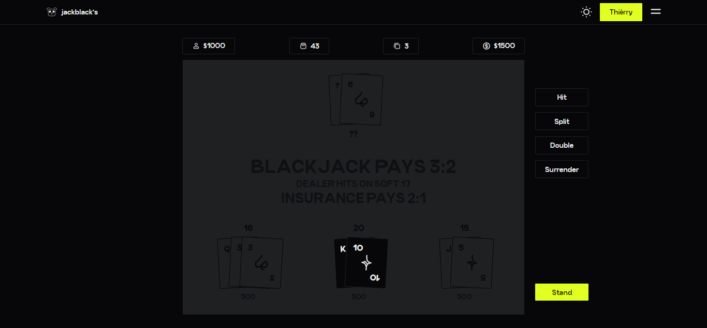

# Jackblackr

A simple blackjack game by [Thierry Ntoh](https://facebook.com/thierryntoh24).



Not that game-changing or anything. Just a fun project.

Have fun, leave me some feedback.

App hosted [here](https://jackblackr.vercel.app). 

Not that responsive

## Local development

Just a head's up, the code is all over the place.

1. Clone the repository

   ```shell
   git clone https://github.com/thierryntoh24/jackblackr.git
   cd jackblackr
   ```

2. Install the dependencies from the respective directories

   ```c
   cd client
   npm install
   ```

   ```c
   cd server
   npm install
   ```

3. Run the app locally (on a split terminal)

   ```
   cd client
   npm run start
   ```
   ```
   cd server
   npm run dev
   ```
